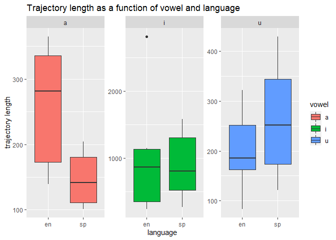
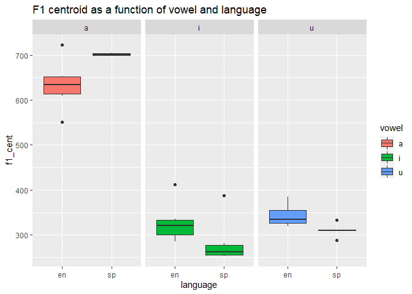
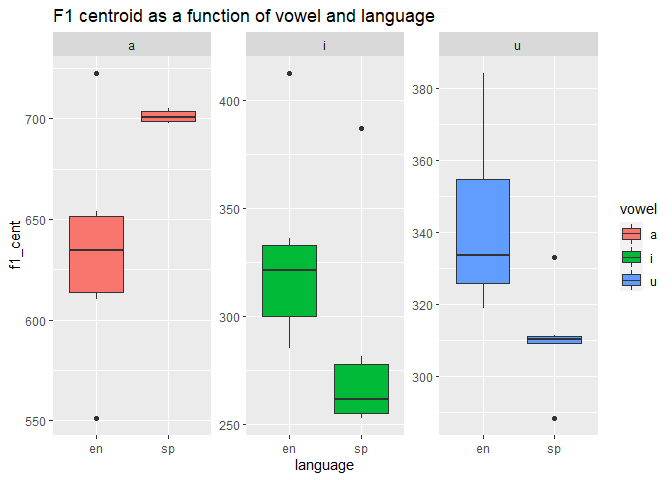
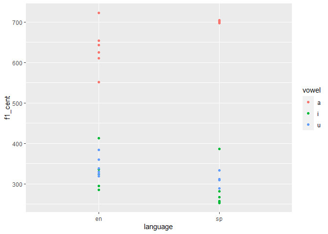
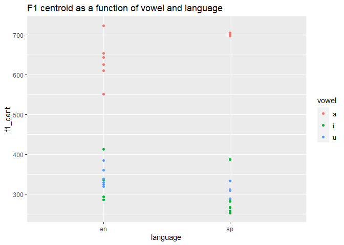
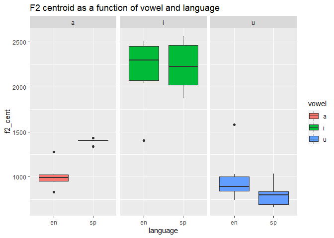
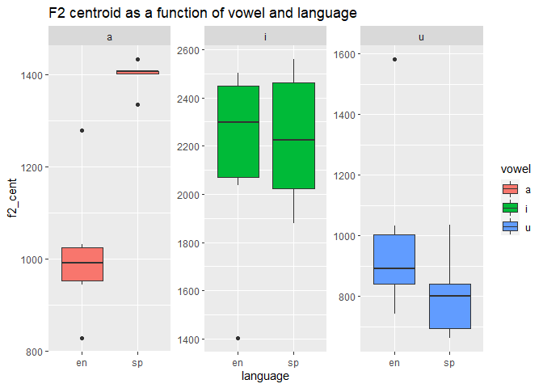
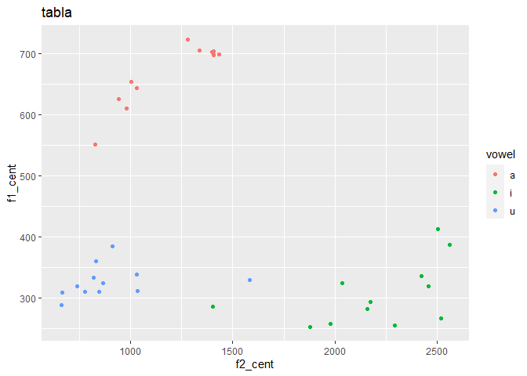
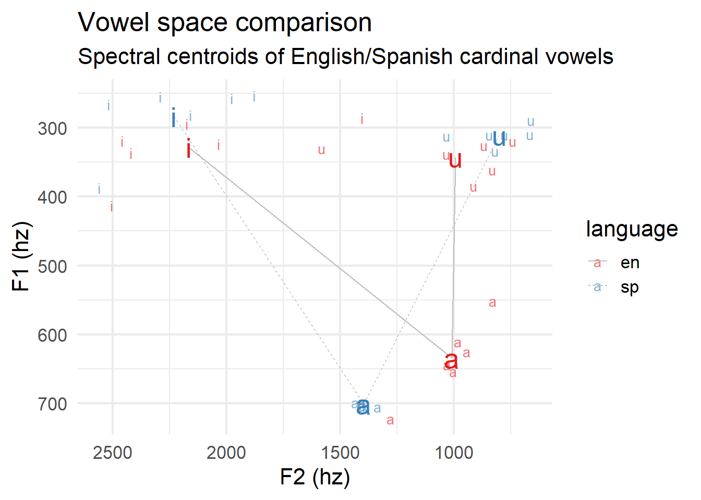

Readme
================
Yo
4/1/2022

# Questions

7 \*\*A\* The first two lines get the values of the onset and the offset
of the vowels, the third line, defines duration, which is the difference
between the offset and the onset. On the second portion of the code, we
see something similar to what we saw on Jacewicz (2011). The idea of
calculating the (20%, 35%, 50%, 65%, 80%) is obtaining time landmarks at
those percentages of the total duration. By obtaining these values, we
can later see the evolution of the vowel at those 5 points, giving as a
better account of the vowel development.

**B** First a .cvs file is created, later, a loop is set. The code sets
the path to the folder where the stimuli files are stored, the code
instructs to gets the .wav file, create strings for .wav file, read the
.wav file and the textgrid. After this, it checks the intervals in the
textgrid, sets default values, and adds a string variable for the given
personal id provided. In the last chunk the code goes through the loop
getting the labels of the intervals, then it gets the onset and offset
of the given intervals, then it gets the item and vowel labels, along
with the language label. The code then instructs to calculate the vowel
onset and offset as the duration of the vowels. After this it calculates
the landmarks in (20%, 35%, 50%, 65%, 80%), gets the formants, and
calculates spectral centroids and trajectory length. Finally, it prints
the results and saves them in the .CVS file

**C** The main difference between both assignments was the number of
files that we manipulated, in this sense, the main change comes with the
main advantage; the less files we manipulate, the less time consuming it
is. Additionally, by having everything in one file it might be easier to
keep track of the file, and not losing spare files on the process.
Regarding the disadvantages, we can attend to a limited amount of audio
time that Praat can process, meaning that if we have a .vaw that is too
long, we might need to split it.

## Load libraries and data

``` r
library(tidyverse)
library(untidydata)
library(ggplot2)
library(readr)
```

``` r
library(tidyverse)
read_csv("data/vowel_data.csv")
```

    ## Rows: 36 Columns: 17
    ## -- Column specification --------------------------------------------------------
    ## Delimiter: ","
    ## chr  (4): id, item, vowel, language
    ## dbl (13): f1_cent, f2_cent, tl, f1_20, f1_35, f1_50, f1_65, f1_80, f2_20, f2...
    ## 
    ## i Use `spec()` to retrieve the full column specification for this data.
    ## i Specify the column types or set `show_col_types = FALSE` to quiet this message.

    ## # A tibble: 36 x 17
    ##    id    item   vowel language f1_cent f2_cent    tl f1_20 f1_35 f1_50 f1_65
    ##    <chr> <chr>  <chr> <chr>      <dbl>   <dbl> <dbl> <dbl> <dbl> <dbl> <dbl>
    ##  1 iar   meet   i     en          413.   2504.  654.  403.  398.  404.  498.
    ##  2 iar   beat   i     en          324.   2036. 1082.  340.  331.  317.  312.
    ##  3 iar   feet   i     en          294.   2174. 2809.  308.  293.  265.  295.
    ##  4 iar   seat   i     en          336.   2421.  259.  311.  348.  341.  344.
    ##  5 iar   heat   i     en          319.   2458.  245.  318.  332.  324.  299.
    ##  6 iar   fleet  i     en          285.   1404. 1152.  318.  270.  303.  273.
    ##  7 iar   moss   a     en          723.   1279.  154.  689.  739.  748.  710.
    ##  8 iar   bot    a     en          654.   1002.  139.  632.  659.  676.  659.
    ##  9 iar   fought a     en          551.    829.  337.  514.  448.  566.  608.
    ## 10 iar   sought a     en          644.   1031.  365.  614.  631.  643.  690.
    ## # ... with 26 more rows, and 6 more variables: f1_80 <dbl>, f2_20 <dbl>,
    ## #   f2_35 <dbl>, f2_50 <dbl>, f2_65 <dbl>, f2_80 <dbl>

``` r
datos = read_csv("data/vowel_data.csv")
```

    ## Rows: 36 Columns: 17
    ## -- Column specification --------------------------------------------------------
    ## Delimiter: ","
    ## chr  (4): id, item, vowel, language
    ## dbl (13): f1_cent, f2_cent, tl, f1_20, f1_35, f1_50, f1_65, f1_80, f2_20, f2...
    ## 
    ## i Use `spec()` to retrieve the full column specification for this data.
    ## i Specify the column types or set `show_col_types = FALSE` to quiet this message.

### Manipulate the dataframe as necessary so that you can calculate average F1/F2 centroids and trajectory length (include SD).

``` r
mean(datos$f1_cent)
```

    ## [1] 433.4297

``` r
sd(datos$f1_cent)
```

    ## [1] 173.8914

``` r
mean(datos$f2_cent)
```

    ## [1] 1433.66

``` r
sd(datos$f2_cent)
```

    ## [1] 623.0602

``` r
mean(datos$tl)
```

    ## [1] 466.3931

``` r
sd(datos$tl)
```

    ## [1] 551.5619

## Plots

#Trajectory length as a function of vowel and language

``` r
ggplot(datos, aes(x=language, y=tl, fill=vowel)) + 
    geom_boxplot() +
    facet_wrap(~vowel, scale="free")+
  labs(title = "Trajectory length as a function of vowel and language", y = "trajectory length")
```

<!-- -->

# 2. F1 as a function of vowel and language

``` r
ggplot(datos, aes(x=language, y=f1_cent, fill=vowel)) + 
    geom_boxplot()+
  facet_wrap(~vowel)+
  labs(title = "F1 centroid as a function of vowel and language")
```

<!-- -->

``` r
ggplot(datos, aes(x=language, y=f1_cent, fill=vowel)) + 
    geom_boxplot() +
    facet_wrap(~vowel, scale="free")+
  labs(title = "F1 centroid as a function of vowel and language")
```

<!-- -->

``` r
library(ggplot2)

ggplot(datos) + geom_point(aes(x=language, y=f1_cent, color=vowel)) + geom_smooth(aes(x=language, y=f1_cent)) 
```

    ## `geom_smooth()` using method = 'loess' and formula 'y ~ x'

<!-- -->

``` r
ggplot(datos, aes(x=language, y=f1_cent)) + geom_point(aes(color=vowel)) + geom_smooth()  
```

    ## `geom_smooth()` using method = 'loess' and formula 'y ~ x'

<!-- -->

``` r
library(ggplot2)

gg <- ggplot (datos, aes(x=language, y= f1_cent, color= vowel)) + geom_point() + labs(title="F1 centroid as a function of vowel and language", x="language", y="f1_cent") 
print(gg)
```

<!-- -->

# 3. F2 as a function of vowel and language

``` r
ggplot(datos, aes(x=language, y=f2_cent, fill=vowel)) + 
    geom_boxplot()+
  facet_wrap(~vowel)+
  labs(title = "F2 centroid as a function of vowel and language")
```

<!-- -->

``` r
ggplot(datos, aes(x=language, y=f2_cent, fill=vowel)) + 
    geom_boxplot() +
    facet_wrap(~vowel, scale="free") +
  labs(title = "F2 centroid as a function of vowel and language")
```

<!-- -->

#(Bonus) Plot trajectory length in F1/F2 vowel space

#(Bonus) Plot spectral centroids in F1/F2 vowel space

``` r
library(ggplot2)

gg <- ggplot (datos, aes(x=f2_cent, y= f1_cent, color= vowel)) + geom_point() + labs(title="tabla", x="f2_cent", y="f1_cent") 
print(gg)
```

<!-- -->

``` r
vowel_means <- datos %>% 
  group_by(vowel, language) %>% 
  summarize(f1_cent = mean(f1_cent), f2_cent = mean(f2_cent)) %>% 
  ungroup() %>% 
  mutate(order = case_when(vowel == "i" ~ 1, vowel == "a" ~ 2, TRUE ~ 3), 
         vowel = forcats::fct_reorder2(vowel, vowel, order)) %>% 
  arrange(order)
```

    ## `summarise()` has grouped output by 'vowel'. You can override using the
    ## `.groups` argument.

``` r
# not sure why this is not working

datos %>% 
  mutate(vowel = forcats::fct_relevel(vowel, "u", "a", "i")) %>% 
  ggplot(., aes(x = f2_cent, y = f1_cent, color = language, label = vowel)) + 
    geom_text(size = 3.5, alpha = 0.6, show.legend = T) + 
    geom_path(data = vowel_means, aes(group = language, lty = language), 
              color = "grey") + 
    geom_text(data = vowel_means, show.legend = F, size = 7) + 
    scale_y_reverse() + 
    scale_x_reverse() + 
    scale_color_brewer(palette = "Set1") + 
    labs(title = "Vowel space comparison", 
         subtitle = "Spectral centroids of English/Spanish cardinal vowels", 
         y = "F1 (hz)", x = "F2 (hz)") + 
    theme_minimal(base_size = 16)
```



I compared me results with bradlow (1995), in my case english /i/ and
/u/ does not cover more vowel space, I guess I am not a native speaker.
It might be fun to compare thes results in class.
